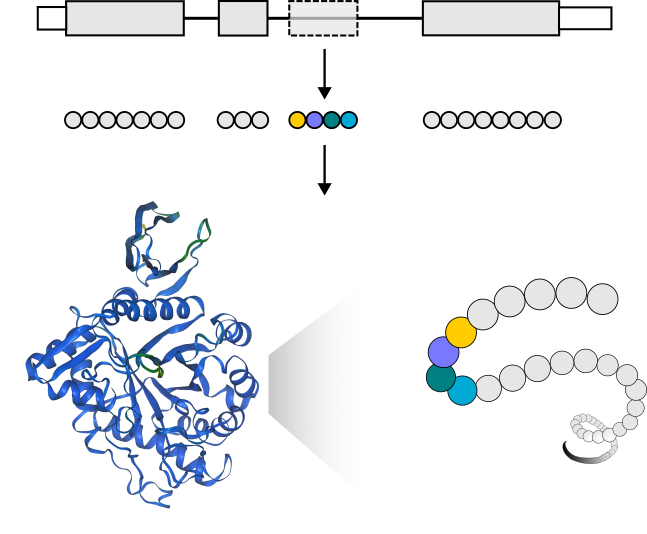

# TX2P - Transcript to protein

    

The purpose of TX2P is to take long read cDNA transcript data, extract putative open reading frames and to then allow easy searching for those predicted proteins in mass spec datasets.

Currently this is only set up to work with GRCH38 data.

## Prerequisites

Before installing TX2P, you need to have Docker installed on your system. Docker is a platform that allows you to create, deploy, and run applications in containers. Follow the instructions below to install Docker if you haven't already:

### Installing Docker

#### For Linux:

1. **Open a Terminal:** Use your Linux distribution's package manager to install Docker. The command varies depending on the distribution:
   - For Ubuntu/Debian: `sudo apt-get install docker-ce docker-ce-cli containerd.io`
   - For Fedora: `sudo dnf -y install docker-ce`
   - For CentOS: `sudo yum install docker-ce docker-ce-cli containerd.io`
2. **Start the Docker Service:** Use `sudo systemctl start docker` to start the Docker service.
3. **Verify Installation:** Check if Docker is installed correctly by typing `docker --version` in the terminal.

## Getting Started:

Download the docker images.

>docker pull murphydaviducl/getorf:latest
>
>docker pull murphydaviducl/metamorpheusdocker:latest
>
>git clone https://github.com/MurphyDavid/TX2P
>
>cd TX2P

"metamorpheusdocker" is a copy of metamorpheus as availible from https://smith-chem-wisc.github.io/MetaMorpheus/ or  https://github.com/smith-chem-wisc/MetaMorpheus
If desired you should be able to use an updated version from those sources. 
Please cite https://doi.org/10.1021/acs.jproteome.7b00873

## Testing:

Getting ORFs

>current_folder=$(pwd)
>
>docker run -v $current_folder:/current_folder  --entrypoint Rscript murphydaviducl/getorf /getcds/getCDSandAAseq.R --gtf /current_folder/test.gtf --transcript /current_folder/test_transcripts.tsv --output /current_folder/output_ORFs.csv

Searching mass spec data.

We download a mass spec file for testing.

>wget ftp://ftp.pride.ebi.ac.uk/pride/data/archive/2020/09/PXD020044/H_Luh_ND_3.raw
>
>current_folder=$(pwd)
>
>mkdir testoutput
>
>cd ./testoutput

And run on the mass spec data. 

>docker run -d -v $current_folder:/current_folder --rm  -it --entrypoint dotnet mymodifiedmetamorpheus:latest /metamorpheus/CMD.dll -o /current_folder/testoutput -t /currentfolder/mmconfig/MetaMorpheusVignette-selected-examples/Task2-CalibrateTaskconfig.toml /currentfolder/mmconfig/MetaMorpheusVignette-selected-examples/Task4-GPTMDTaskconfig.toml currentfolder/mmconfig/MetaMorpheusVignette-selected-examples/Task5-SearchTaskconfig.toml -d /current_folder/test.fasta -s /currentfolder/H_Luh_ND_3.raw

You can add almost any number of additional mass spec files though we suggest keeping it to less than 100GB or so. You can give the docker access to additional folders by adding  more in the format "-v folder:/mountname"

Supported formats are 

>Thermo .raw 
>
>.mzML file in centroid mode.
>
>.mgf

